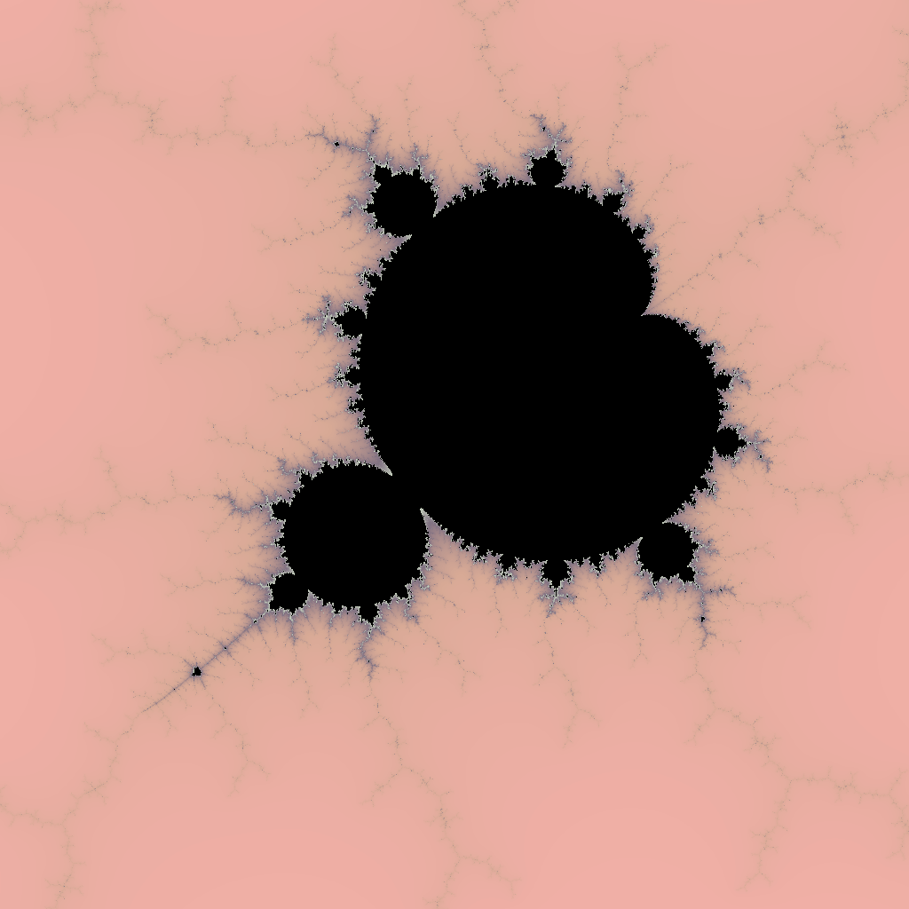
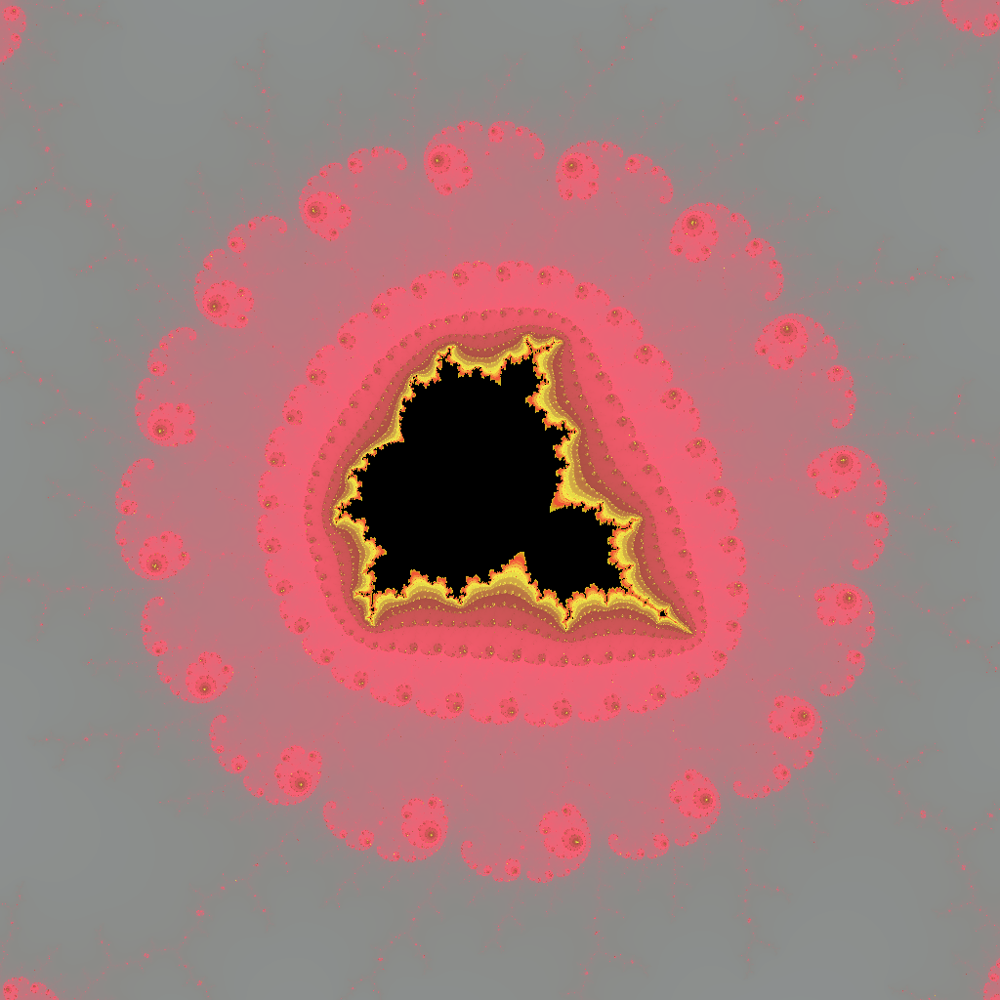

# gemstone
## A colourful visualizer 
The project follows a basic structure, the user does their drawing commands on an image object, they may choose to output one or multiple images(incase they want to do animations)
The skeleton only handles basic operations, such as manipulating pixels in an image, manipulating colours in the palette and very simple image I/O.

## features
- **palette loading from csv files**
- **palette interpolation**
> 
> 
- **ppm image output** 
> 
- **line rasterization**
> 
- **easy to add command line arguments**

## DEPS
**NONE WE FINALLY HAVE NO DEPENDENCIES!**

## goals
- POSIX compliant command line arguments

## EXAMPLES
> these two examples might look "glitchy" since I'm using a monte-carlo method to make rendering faster.
> 
> 
> 

> 
> 
> 

## THIS PROJECT IS A WORK IN PROGRESS, YOU CAN CHECK MY PROFILE FOR MORE COMPLEX EXAMPLES
